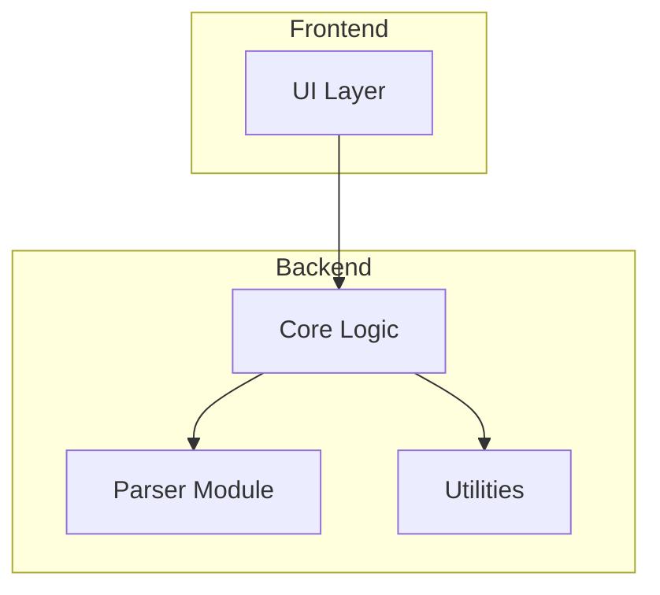

# Package Design

This document captures the package/module structure and their dependencies using Mermaid.js diagrams.

> **IMPORTANT:** This diagram MUST be updated whenever the package structure changes. The AI agent should maintain this file alongside code generation.

## Module Dependency Diagram

TODO: Generate the Mermaid.js diagram once the project structure is defined.

## Module Descriptions

| Module | Responsibility | Depends On |
|---|---|---|
| _(populated during development)_ | — | — |
